# Implémentation FortiGate SD-WAN — Lab EVE-NG

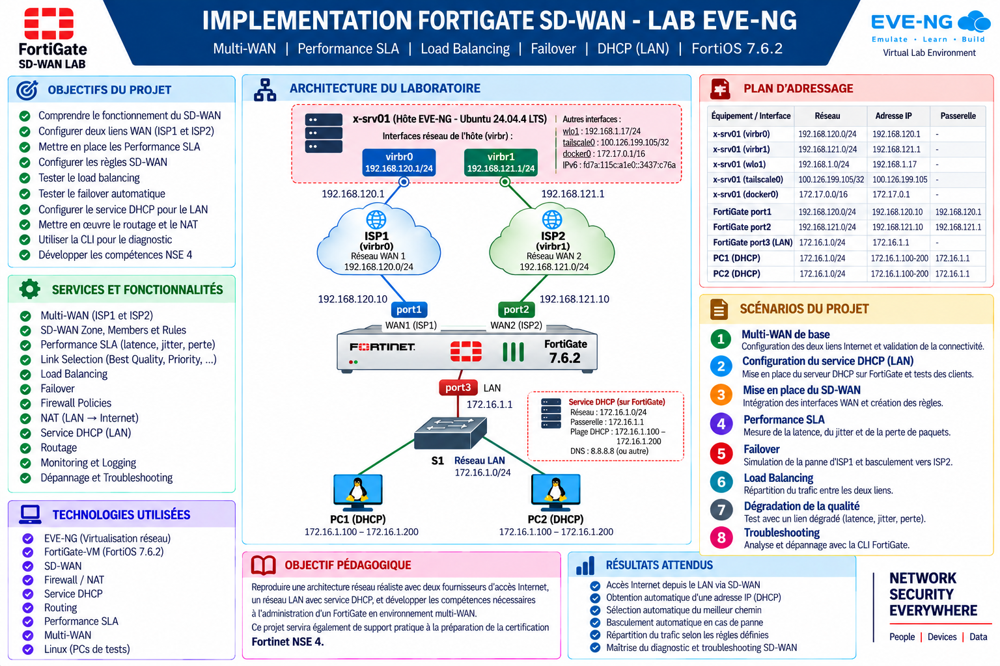

*Synthèse du projet : objectifs, architecture, plan d'adressage, services, scénarios et résultats attendus.*

---

## Table des matières

1. [Présentation du projet](#1-présentation-du-projet)
2. [Objectifs](#2-objectifs)
3. [Services et fonctionnalités](#3-services-et-fonctionnalités)
4. [Architecture du laboratoire](#4-architecture-du-laboratoire)
5. [Plan d'adressage](#5-plan-d'adressage)
6. [Technologies utilisées](#6-technologies-utilisées)
7. [Configuration du réseau LAN](#7-configuration-du-réseau-lan)
8. [Configuration des interfaces WAN](#8-configuration-des-interfaces-wan)
9. [Configuration du routage](#9-configuration-du-routage)
10. [Configuration du NAT](#10-configuration-du-nat)
11. [Configuration du SD-WAN](#11-configuration-du-sd-wan)

---
## 1. Présentation du projet

Ce projet consiste à mettre en œuvre une architecture **SD-WAN (Software-Defined Wide Area Network)** avec un **FortiGate-VM sous FortiOS 7.6.2**, dans un environnement de laboratoire virtualisé avec **EVE-NG**.

L'objectif est de simuler une entreprise disposant de **deux accès WAN/Internet indépendants (ISP1 et ISP2)** et d'un réseau LAN interne.

Le FortiGate est utilisé pour centraliser la connectivité Internet et mettre en œuvre une **sélection intelligente des chemins réseau** grâce aux fonctionnalités SD-WAN.

Le projet permet d'étudier :

- La **sélection dynamique des liens**
- Les **Performance SLA**
- Le **load balancing**
- Le **failover automatique**
- Le **diagnostic des connexions WAN**

Le réseau LAN dispose également d'un **serveur DHCP directement configuré sur le FortiGate**, permettant aux postes clients d'obtenir automatiquement leur configuration réseau.

---

## 2. Objectifs

Les principaux objectifs du projet sont :

- Comprendre le fonctionnement du **SD-WAN** sur FortiGate.
- Configurer **deux connexions WAN** avec ISP1 et ISP2.
- Configurer le **réseau LAN** du FortiGate.
- Mettre en place le **service DHCP** pour les clients LAN.
- Configurer le **routage** vers les deux fournisseurs WAN.
- Configurer le **NAT** pour l'accès Internet.
- Intégrer les interfaces WAN dans le **SD-WAN**.
- Créer et comprendre les **règles SD-WAN**.
- Mettre en place des **Performance SLA**.
- Mesurer la **qualité des différents liens WAN**.
- Tester le **load balancing**.
- Tester le **failover automatique**.
- Simuler la **dégradation d'un lien WAN**.
- Observer la **sélection automatique** du meilleur chemin.
- Utiliser la **CLI FortiGate** pour le diagnostic.
- Développer les compétences pratiques nécessaires à la préparation du **NSE 4**.

---

## 3. Services et fonctionnalités

### 3.1 Multi-WAN

Le FortiGate dispose de **deux connexions WAN** :

- **ISP1** — réseau `192.168.120.0/24`
- **ISP2** — réseau `192.168.121.0/24`

Ces deux connexions constituent les chemins WAN gérés par le SD-WAN.

### 3.2 SD-WAN

Le SD-WAN contrôle intelligemment la **sélection des chemins** en fonction des règles et des performances des liens.

Les éléments étudiés sont :

- SD-WAN Zone
- SD-WAN Members
- SD-WAN Rules
- Link Selection
- Priority
- Best Quality
- Load Balancing
- Failover

### 3.3 Performance SLA

Des contrôles de performance sont configurés pour évaluer les différents chemins WAN :

- **Latence**
- **Jitter**
- **Perte de paquets**
- **Disponibilité du lien**

Les résultats des SLA influencent automatiquement la sélection du chemin par le FortiGate.

### 3.4 Failover

Le projet permet de tester le **basculement automatique** lorsqu'un lien WAN devient indisponible ou ne respecte plus les critères de performance définis.

En fonctionnement normal :

```text
ISP1 ✅
   │
   ▼
SD-WAN
   │
   ▼
Internet
```

En cas de panne :

```text
ISP1 ❌
   │
   ▼
SD-WAN
   │
   ▼
ISP2 ✅
   │
   ▼
Internet
```

### 3.5 Load Balancing

Répartition du trafic entre plusieurs liens WAN selon les **règles SD-WAN** configurées.

### 3.6 Firewall et NAT

Le FortiGate assure :

- **Firewall Policies**
- **NAT**
- **Contrôle du trafic LAN → WAN**
- **Routage**
- **Sélection du chemin WAN**

### 3.7 Service DHCP

Le FortiGate fournit automatiquement les paramètres réseau aux clients du LAN.

```text
Réseau LAN       : 172.16.1.0/24
Passerelle       : 172.16.1.1
Plage DHCP       : 172.16.1.100 - 172.16.1.200
```

Les postes **PC1** et **PC2** utilisent DHCP.

---

## 4. Architecture du laboratoire

Le laboratoire est réalisé avec **EVE-NG**.

L'architecture repose sur :

- Un hôte **`x-srv01`** hébergeant EVE-NG.
- Deux **réseaux WAN virtuels** (`virbr0` pour ISP1, `virbr1` pour ISP2).
- Un **FortiGate-VM** (FortiOS 7.6.2).
- Un **réseau LAN** (`172.16.1.0/24`).
- Un **switch S1**.
- Deux **postes clients Linux** (PC1, PC2).

### Topologie

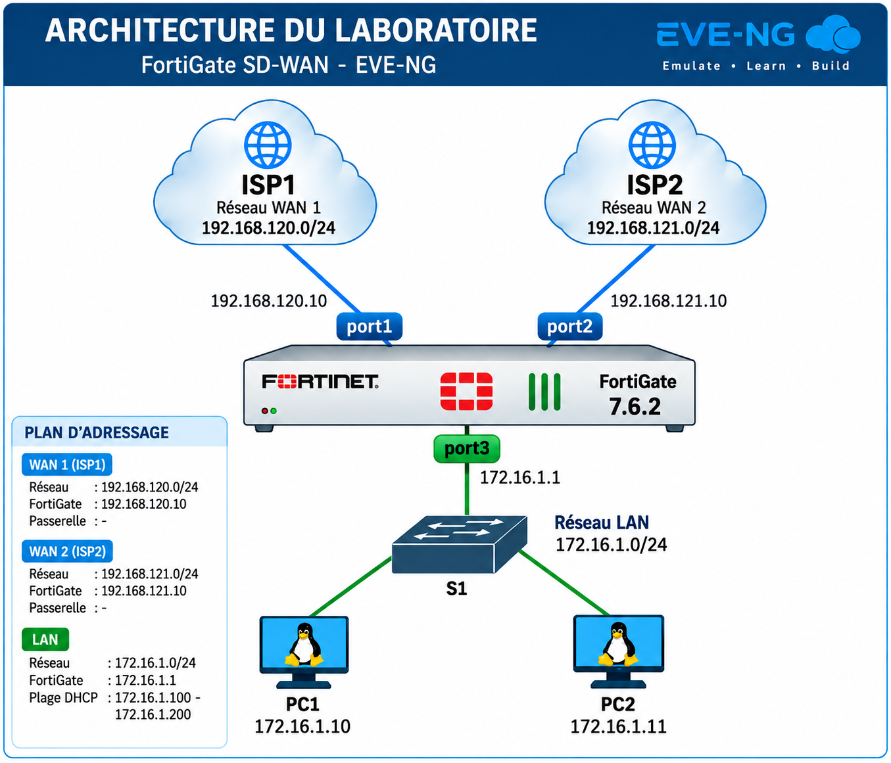

*Topologie complète : FortiGate-VM avec deux accès WAN (ISP1 / ISP2) et un réseau LAN desservi par un switch S1.*

---

## 5. Plan d'adressage

| Équipement / Interface | Fonction | Réseau | Adresse IP | Passerelle |
|---|---|---|---|---|
| `x-srv01 / virbr0` | WAN ISP1 | `192.168.120.0/24` | `192.168.120.1` | — |
| `FortiGate port1` | WAN ISP1 | `192.168.120.0/24` | `192.168.120.10` | `192.168.120.1` |
| `x-srv01 / virbr1` | WAN ISP2 | `192.168.121.0/24` | `192.168.121.1` | — |
| `FortiGate port2` | WAN ISP2 | `192.168.121.0/24` | `192.168.121.10` | `192.168.121.1` |
| `FortiGate port3` | LAN | `172.16.1.0/24` | `172.16.1.1` | — |
| `PC1` | Client DHCP | `172.16.1.0/24` | DHCP (`172.16.1.100 - 200`) | `172.16.1.1` |
| `PC2` | Client DHCP | `172.16.1.0/24` | DHCP (`172.16.1.100 - 200`) | `172.16.1.1` |

---

## 6. Technologies utilisées

| Technologie | Rôle |
|---|---|
| **EVE-NG** | Virtualisation réseau |
| **FortiGate-VM** | Firewall / SD-WAN (FortiOS 7.6.2) |
| **SD-WAN** | Sélection intelligente des chemins |
| **Firewall / NAT** | Sécurité et accès Internet |
| **Service DHCP** | Attribution automatique des adresses LAN |
| **Routing** | Routage inter-réseaux |
| **Performance SLA** | Mesure de la qualité des liens |
| **Multi-WAN** | Gestion de deux accès Internet |
| **Linux** | Postes clients de test |

---

### 6.1 Initialisation et préparation du FortiGate

Avant de commencer la configuration réseau, le FortiGate-VM a été démarré et préparé pour le laboratoire.

#### 6.1.1 Première connexion

Lors de la première connexion avec le compte `admin`, FortiOS a imposé le changement du mot de passe administrateur.

```text
FortiGate-VM64-KVM login: admin
Password:

You are forced to change your password. Please input a new password.
New Password:
Confirm Password:
Verifying password...

Welcome!
```

Le nouveau mot de passe administrateur a été défini avec succès.

---

#### 6.1.2 Configuration du hostname

Afin d'identifier clairement le firewall dans le laboratoire, le hostname a été configuré avec :

```bash
config system global
    set hostname FortiGate-SDWAN
end
```

Le FortiGate utilise désormais le nom :

```text
FortiGate-SDWAN
```

---

#### 6.1.3 Vérification de l'interface `port1`

Lors de l'installation initiale du FortiGate-VM, l'interface `port1` correspond à l'**interface de management par défaut** de la VM.

Elle était donc initialement configurée en DHCP, ce qui permettait au FortiGate d'obtenir automatiquement une adresse IP afin d'assurer l'accès initial à l'équipement.

La configuration a été vérifiée avec :

```bash
show system interface port1
```

Résultat :

```text
config system interface
    edit "port1"
        set vdom "root"
        set mode dhcp
        set allowaccess ping https ssh http
        set type physical
        set snmp-index 1
    next
end
```

L'adresse IP obtenue dynamiquement a ensuite été vérifiée avec :

```bash
diagnose ip address list
```

Résultat :

```text
IP=192.168.120.60->192.168.120.60/255.255.255.0
index=3 devname=port1
```

`port1` avait donc obtenu automatiquement l'adresse :

```text
192.168.120.60/24
```

sur le réseau `192.168.120.0/24`.

Cette configuration DHCP correspond à l'état **initial** de l'interface de management. Dans la configuration finale du laboratoire, `port1` sera utilisé comme **WAN ISP1** avec l'adresse statique prévue dans le plan d'adressage :

```text
192.168.120.10/24
```

> **À retenir** : aucune modification de `port1` n'a été effectuée à cette étape. On documente uniquement son état initial.

---

#### 6.1.4 Vérification initiale de la licence

Avant de poursuivre la configuration, l'état de la licence du FortiGate-VM a été vérifié avec :

```bash
get system status
```

Le résultat indiquait :

```text
Version: FortiGate-VM64-KVM v7.6.2,build3462,250127 (GA.F)
Serial-Number: FGVMEVPXR5SNN5CB
License Status: Invalid
```

La licence de la VM était donc initialement **invalide**.

---

#### 6.1.5 Première tentative d'activation de la licence

La commande d'activation a d'abord été exécutée :

```bash
execute vm-license
```

Le FortiGate a indiqué qu'un `Account ID` devait être renseigné au préalable :

```text
Please input account-id by execute vm-license-options account-id.
```

L'activation n'a donc pas été poursuivie à cette étape.

---

#### 6.1.6 Configuration de l'Account ID

L'Account ID du compte Fortinet a ensuite été renseigné avec :

```bash
execute vm-license-options account-id <ACCOUNT_ID>
```

---

#### 6.1.7 Configuration du mot de passe du compte

Le mot de passe associé au compte Fortinet a ensuite été renseigné avec :

```bash
execute vm-license-options account-password <ACCOUNT_PASSWORD>
```

> ⚠️ Les informations d'authentification **ne sont pas enregistrées** dans le dépôt GitHub.

---

#### 6.1.8 Vérification des options de licence

Les paramètres configurés ont été vérifiés avec :

```bash
execute vm-license-options show
```

Le FortiGate a confirmé :

```text
VM license options:
    Account ID: fortilearn..........
    Account password: ............
    Government: no
    Token: (null)
    Proxy: (null)
    Interval: 10
    Count: 1
```

Les paramètres nécessaires à l'activation étaient donc correctement configurés.

---

#### 6.1.9 Activation de la licence d'évaluation

L'activation a ensuite été lancée avec :

```bash
execute vm-license
```

Le FortiGate a proposé l'utilisation de la licence d'évaluation :

```text
This VM is using the evaluation license.
This license does not expire.
```

Les principales limitations indiquées par FortiOS étaient :

```text
1. Support for low encryption operation only
2. Maximum of 1 CPU and 2GiB of memory
3. Maximum of three interfaces, firewall policies, and routes each
4. No FortiCare Support
```

Après confirmation :

```text
Do you want to continue? (y/n)y
```

Le FortiGate a confirmé :

```text
Requesting FortiCare Trial license, proxy:(null)
VM license install succeeded. Rebooting firewall.
```

Le FortiGate a automatiquement redémarré afin d'appliquer la licence.

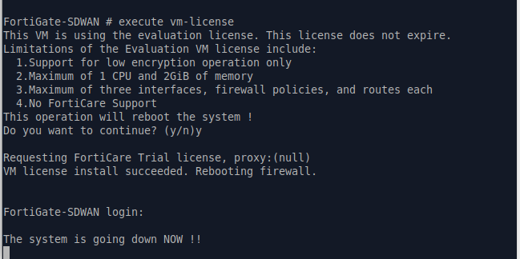

*Activation de la licence d'évaluation FortiCare Trial : confirmation des limitations, demande d'acceptation, installation réussie et redémarrage automatique du FortiGate.*

---

#### 6.1.10 Vérification de la licence après redémarrage

Après le redémarrage, la commande suivante a été exécutée :

```bash
get system status
```

Le résultat a confirmé :

```text
Serial-Number: FGVMEVPXR5SNN5CB
License Status: Valid
VM Resources: 1 CPU/1 allowed, 1993 MB RAM/2048 MB allowed
Hostname: FortiGate-SDWAN
Operation Mode: NAT
```

La licence d'évaluation est donc maintenant **valide et active**.

Le FortiGate dispose actuellement des ressources autorisées par cette licence :

```text
CPU : 1
RAM : 2 GiB
```

### Vérification depuis l'interface graphique

L'accès à l'interface graphique du FortiGate a également été vérifié après l'activation de la licence.

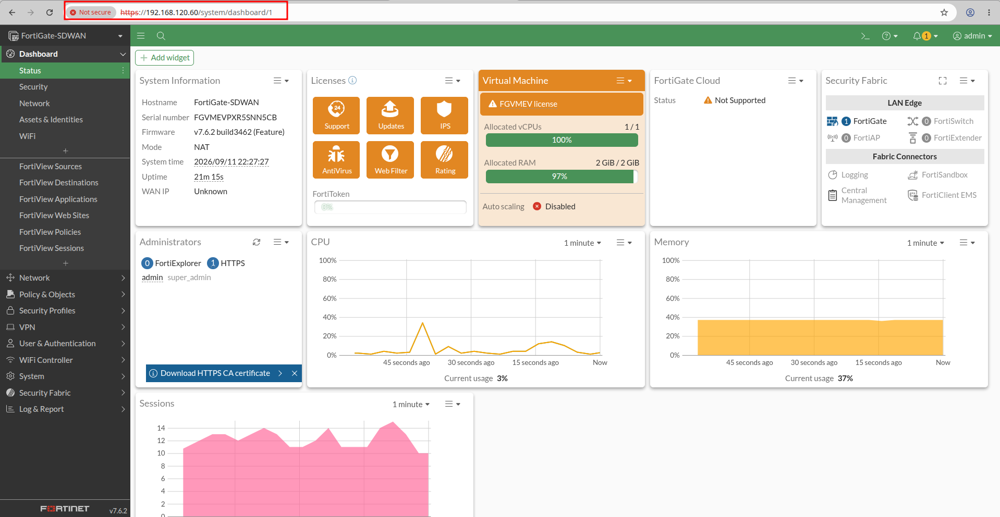

Le tableau de bord confirme notamment :

- Hostname : `FortiGate-SDWAN`
- FortiOS : `v7.6.2 build3462`
- Licence de la VM active
- 1 vCPU alloué
- 2 GiB de RAM alloués

---

## 7. Configuration du réseau LAN

### 7.1 Configuration de l'interface port3 (LAN)

L'interface `port3` est utilisée comme **interface LAN** du FortiGate. Elle constitue la passerelle du réseau `172.16.1.0/24`.

```bash
config system interface
    edit port3
        set mode static
        set ip 172.16.1.1 255.255.255.0
        set allowaccess ping
        set alias LAN
        set role lan
    next
end
```

Vérification :

```bash
show system interface port3
```

Résultat :

```text
config system interface
    edit "port3"
        set vdom "root"
        set ip 172.16.1.1 255.255.255.0
        set allowaccess ping
        set type physical
        set alias "LAN"
        set device-identification enable
        set lldp-transmission enable
        set role lan
        set snmp-index 3
    next
end
```

**Validation : interface `port3` configurée comme passerelle LAN `172.16.1.1/24`. ✅**

---

### 7.2 Configuration du service DHCP (LAN)

Le FortiGate fournit le DHCP pour le réseau LAN `172.16.1.0/24`.

```bash
config system dhcp server
    edit 1
        set interface port3
        set default-gateway 172.16.1.1
        set netmask 255.255.255.0
        set dns-service default
        config ip-range
            edit 1
                set start-ip 172.16.1.10
                set end-ip 172.16.1.100
            next
        end
    next
end
```

Vérification :

```bash
show system dhcp server
```

Résultat :

```text
config system dhcp server
    edit 1
        set dns-service default
        set ntp-service local
        set default-gateway 172.16.1.1
        set netmask 255.255.255.0
        set interface "port3"
        config ip-range
            edit 1
                set start-ip 172.16.1.10
                set end-ip 172.16.1.100
            next
        end
        set vci-match enable
        set vci-string "FortiSwitch" "FortiExtender"
    next
end
```

---

### 7.3 Désactivation du filtrage VCI

Comme dans le lab SSL VPN, le serveur DHCP est configuré par défaut avec une restriction par **Vendor Class Identifier (VCI)** :

```text
set vci-match enable
set vci-string "FortiSwitch" "FortiExtender"
```

⚠️ **Cette restriction empêche les clients non-Fortinet** (PC Linux, Windows, VPCS) d'obtenir une adresse DHCP.

Désactivation :

```bash
config system dhcp server
    edit 1
        set vci-match disable
    end
```

Vérification :

```bash
show system dhcp server
```

Résultat :

```text
config system dhcp server
    edit 1
        set dns-service default
        set ntp-service local
        set default-gateway 172.16.1.1
        set netmask 255.255.255.0
        set interface "port3"
        config ip-range
            edit 1
                set start-ip 172.16.1.10
                set end-ip 172.16.1.100
            next
        end
    next
end
```

> ⚠️ **À retenir** : le filtrage VCI est **activé par défaut** sur le serveur DHCP FortiGate. C'est un piège récurrent qui empêche les clients standards d'obtenir une adresse. Il a déjà été rencontré dans le lab SSL VPN.

**Validation : filtrage VCI désactivé. ✅**

---

### 7.4 Ajustement de la plage DHCP

La plage initiale (`172.16.1.10 - 172.16.1.100`) a été ajustée pour correspondre au plan d'adressage documenté (`172.16.1.100 - 172.16.1.200`).

```bash
config system dhcp server
    edit 1
        config ip-range
            edit 1
                set start-ip 172.16.1.100
                set end-ip 172.16.1.200
            next
        end
    next
end
```

Vérification :

```bash
show system dhcp server
```

Résultat final :

```text
config system dhcp server
    edit 1
        set dns-service default
        set ntp-service local
        set default-gateway 172.16.1.1
        set netmask 255.255.255.0
        set interface "port3"
        config ip-range
            edit 1
                set start-ip 172.16.1.100
                set end-ip 172.16.1.200
            next
        end
    next
end
```

**Validation : plage DHCP `172.16.1.100 - 172.16.1.200` conforme au plan d'adressage. ✅**

---

## 8. Configuration des interfaces WAN

Le FortiGate dispose de deux accès WAN distincts : **ISP1** (port1) et **ISP2** (port2). Chacun est configuré en IP statique conformément au plan d'adressage.

### 8.1 Configuration de port1 — WAN ISP1

L'interface `port1` est utilisée comme **WAN ISP1**. Elle est configurée en IP statique sur le réseau `192.168.120.0/24`.

```bash
config system interface
    edit port1
        set mode static
        set ip 192.168.120.10 255.255.255.0
        set alias WAN-ISP1
        set role wan
        set allowaccess ping https ssh
    next
end
```

Vérification :

```bash
show system interface port1
```

Résultat :

```text
config system interface
    edit "port1"
        set vdom "root"
        set ip 192.168.120.10 255.255.255.0
        set allowaccess ping https ssh
        set type physical
        set alias "WAN-ISP1"
        set lldp-reception enable
        set role wan
        set snmp-index 1
    next
end
```

**Validation : port1 configurée en WAN ISP1 avec l'IP statique `192.168.120.10/24`. ✅**

> **Note** : `port1` était initialement configurée en DHCP (interface de management par défaut de la VM FortiGate). Elle a été basculée en IP statique pour correspondre au plan d'adressage du laboratoire.

---

### 8.2 Configuration de port2 — WAN ISP2

L'interface `port2` est utilisée comme **WAN ISP2**. Elle est configurée en IP statique sur le réseau `192.168.121.0/24`.

```bash
config system interface
    edit port2
        set mode static
        set ip 192.168.121.10 255.255.255.0
        set alias WAN-ISP2
        set role wan
        set allowaccess ping https ssh
    next
end
```

Vérification :

```bash
show system interface port2
```

Résultat :

```text
config system interface
    edit "port2"
        set vdom "root"
        set ip 192.168.121.10 255.255.255.0
        set allowaccess ping https ssh
        set type physical
        set alias "WAN-ISP2"
        set lldp-reception enable
        set role wan
        set snmp-index 2
    next
end
```

**Validation : port2 configurée en WAN ISP2 avec l'IP statique `192.168.121.10/24`. ✅**

---

### 8.3 Validation des interfaces WAN et LAN

Vérification de l'ensemble des interfaces configurées :

```bash
show system interface
```

Extrait des interfaces configurées :

```text
config system interface
    edit "port1"
        set ip 192.168.120.10 255.255.255.0
        set alias "WAN-ISP1"
        set role wan
    next
    edit "port2"
        set ip 192.168.121.10 255.255.255.0
        set alias "WAN-ISP2"
        set role wan
    next
    edit "port3"
        set ip 172.16.1.1 255.255.255.0
        set alias "LAN"
        set role lan
    next
end
```

**Validation : les trois interfaces sont correctement configurées. ✅**

| Interface | Rôle | IP | Alias |
|---|---|---|---|
| `port1` | WAN | `192.168.120.10/24` | `WAN-ISP1` |
| `port2` | WAN | `192.168.121.10/24` | `WAN-ISP2` |
| `port3` | LAN | `172.16.1.1/24` | `LAN` |

---

## 9. Configuration du routage

Après la configuration des interfaces et du DHCP, il reste à mettre en place le **routage vers Internet** via les deux accès WAN (ISP1 et ISP2).

### 9.1 Route par défaut vers ISP1

La première route par défaut a été configurée vers la passerelle ISP1.

```bash
config router static
    edit 1
        set gateway 192.168.120.1
        set device port1
    next
end
```

Vérification de la table de routage :

```bash
get router info routing-table all
```

Résultat (extrait) :

```text
Routing table for VRF=0
S*      0.0.0.0/0 [10/0] via 192.168.120.1, port1, [1/0]
C       172.16.1.0/24 is directly connected, port3
C       192.168.120.0/24 is directly connected, port1
C       192.168.121.0/24 is directly connected, port2
```

La route `S*  0.0.0.0/0` est la route par défaut (candidate default).

**Validation : route par défaut vers ISP1 présente. ✅**

---

### 9.2 Route par défaut vers ISP2

La deuxième route par défaut a été configurée vers la passerelle ISP2.

```bash
config router static
    edit 2
        set dst 0.0.0.0 0.0.0.0
        set gateway 192.168.121.1
        set device port2
    next
end
```

**Rôle des commandes :**
- `edit 2` : crée la deuxième route.
- `set dst 0.0.0.0 0.0.0.0` : destination par défaut (tous les réseaux).
- `set gateway 192.168.121.1` : définit la passerelle ISP2.
- `set device port2` : interface de sortie.

> **Note** : la destination `0.0.0.0/0` signifie « toutes les adresses IP ». Un message de confirmation est affiché par le FortiGate :
>
> ```text
> The destination is set to 0.0.0.0/0 which means all IP addresses.
> ```

Vérification :

```bash
get router info routing-table all
```

Résultat :

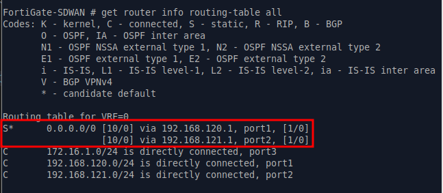

*Table de routage après ajout de la seconde route par défaut. Les deux routes `0.0.0.0/0` vers ISP1 (`port1`) et ISP2 (`port2`) coexistent avec la même distance administrative (10).*

**Validation : les deux routes par défaut sont actives. ✅**

---

### 9.3 Choix d'architecture : ECMP

Les deux routes par défaut (ISP1 et ISP2) ont été configurées avec la **même distance administrative (10)**, permettant un **ECMP (Equal-Cost Multi-Path)**.

Le FortiGate peut ainsi utiliser les deux liens simultanément, ce qui offre :

- **Load balancing** automatique entre les deux WAN.
- **Failover** transparent si un lien tombe.
- **Meilleure utilisation** de la bande passante.

> **Note** : ce choix est **cohérent avec l'objectif SD-WAN** du projet. La sélection fine des liens (priorité, best quality, load balancing) sera gérée ultérieurement par les **règles SD-WAN** et les **Performance SLA**, pas par les routes.

---

### 9.4 Test d'accès Internet

#### 9.4.1 Test via ISP1 (route par défaut)

Depuis le FortiGate, test d'accès Internet :

```bash
execute ping 8.8.8.8
```

Résultat :

```text
PING 8.8.8.8 (8.8.8.8): 56 data bytes
64 bytes from 8.8.8.8: icmp_seq=0 ttl=114 time=74.8 ms
64 bytes from 8.8.8.8: icmp_seq=1 ttl=114 time=72.5 ms
64 bytes from 8.8.8.8: icmp_seq=2 ttl=114 time=73.2 ms
64 bytes from 8.8.8.8: icmp_seq=3 ttl=114 time=72.6 ms
64 bytes from 8.8.8.8: icmp_seq=4 ttl=114 time=74.3 ms

--- 8.8.8.8 ping statistics ---
5 packets transmitted, 5 packets received, 0% packet loss
round-trip min/avg/max = 72.5/73.4/74.8 ms
```

**Validation : accès Internet fonctionnel via ISP1. ✅**

#### 9.4.2 Test forcé via ISP2

Pour vérifier que le lien ISP2 fonctionne également, le ping a été forcé via l'interface `port2` :

```bash
execute ping-options interface port2
execute ping 8.8.8.8
```

Résultat :

```text
PING 8.8.8.8 (8.8.8.8): 56 data bytes
64 bytes from 8.8.8.8: icmp_seq=0 ttl=114 time=77.0 ms
64 bytes from 8.8.8.8: icmp_seq=1 ttl=114 time=148.9 ms
64 bytes from 8.8.8.8: icmp_seq=2 ttl=114 time=90.9 ms
64 bytes from 8.8.8.8: icmp_seq=3 ttl=114 time=80.6 ms
64 bytes from 8.8.8.8: icmp_seq=4 ttl=114 time=72.2 ms

--- 8.8.8.8 ping statistics ---
5 packets transmitted, 5 packets received, 0% packet loss
round-trip min/avg/max = 72.2/93.9/148.9 ms
```

**Validation : accès Internet fonctionnel via ISP2. ✅**

---

### 9.5 Test de failover automatique

Un test de failover a été réalisé en **désactivant temporairement** l'interface `port1` (WAN ISP1).

```bash
config system interface
    edit port1
        set status down
    next
end
```

Puis un ping vers Internet :

```bash
execute ping 8.8.8.8
```

Résultat :

```text
PING 8.8.8.8 (8.8.8.8): 56 data bytes
64 bytes from 8.8.8.8: icmp_seq=0 ttl=114 time=86.3 ms
64 bytes from 8.8.8.8: icmp_seq=1 ttl=114 time=74.2 ms
64 bytes from 8.8.8.8: icmp_seq=2 ttl=114 time=71.5 ms
64 bytes from 8.8.8.8: icmp_seq=3 ttl=114 time=71.4 ms
64 bytes from 8.8.8.8: icmp_seq=4 ttl=114 time=79.6 ms

--- 8.8.8.8 ping statistics ---
5 packets transmitted, 5 packets received, 0% packet loss
round-trip min/avg/max = 71.4/76.6/86.3 ms
```

**Interprétation** : le trafic a été automatiquement redirigé vers **ISP2** (`port2`), sans interruption.

`port1` a ensuite été réactivée :

```bash
config system interface
    edit port1
        set status up
    next
end
```

**Validation : le failover automatique au niveau routage est fonctionnel. ✅**

> **Note** : à ce stade, le failover est basé sur l'**état de l'interface** (up/down). Le SD-WAN permettra d'aller plus loin en détectant les **dégradations de performance** (latence, jitter, perte) via les **Performance SLA**.

---

### 9.6 Test DHCP depuis un client LAN

Un client Linux (PC1) connecté au switch S1 a été utilisé pour valider le fonctionnement du DHCP.

#### 9.6.1 Premier test DHCP — résultat incohérent

Vérification de l'adresse IP obtenue :

```bash
ip addr show eth0
```

Résultat :

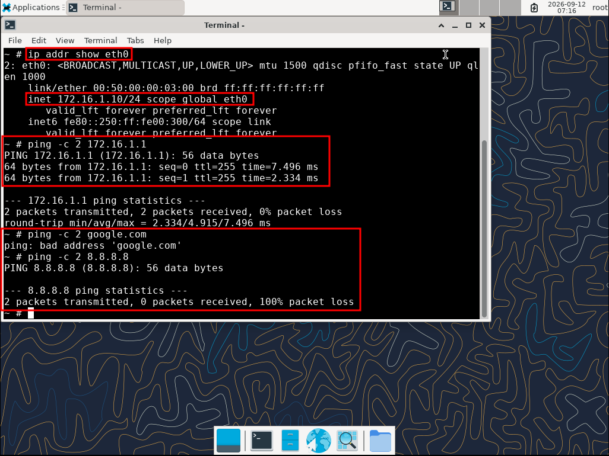

*Le client PC1 a obtenu l'adresse `172.16.1.10/24` via le serveur DHCP du FortiGate.*

Extrait :

```text
2: eth0: <BROADCAST,MULTICAST,UP,LOWER_UP> mtu 1500 qdisc pfifo_fast state UP
    link/ether 00:50:00:00:03:00 brd ff:ff:ff:ff:ff:ff
    inet 172.16.1.10/24 scope global eth0
```

**Problème** : l'adresse obtenue `172.16.1.10` **ne correspond pas** à la plage DHCP configurée sur le FortiGate, qui est `172.16.1.100 - 172.16.1.200`.

Test de connectivité vers la passerelle :

```bash
ping -c 2 172.16.1.1
```

Résultat :

```text
PING 172.16.1.1 (172.16.1.1): 56 data bytes
64 bytes from 172.16.1.1: icmp_seq=0 ttl=255 time=7.496 ms
64 bytes from 172.16.1.1: icmp_seq=1 ttl=255 time=2.334 ms

--- 172.16.1.1 ping statistics ---
2 packets transmitted, 2 packets received, 0% packet loss
```

Le client atteint la passerelle LAN, mais l'adresse obtenue n'est pas cohérente avec la configuration DHCP prévue.

---

#### 9.6.2 Diagnostic — incohérence GUI / CLI

Lors de la vérification dans l'interface graphique **Network → Interfaces → LAN (port3)**, le mode **IPAM** apparaissait comme sélectionné dans la section **Addressing mode**.

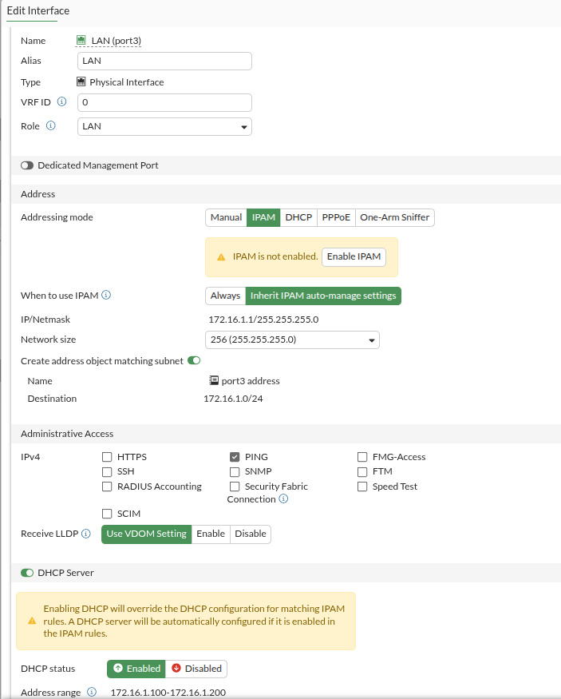

*État initial : le mode `IPAM` est sélectionné alors que la configuration CLI utilise une IP statique. Un message d'avertissement `IPAM is not enabled` apparaît.*

Pourtant, la configuration CLI de l'interface `port3` était bien en mode statique :

```bash
config system interface
    edit "port3"
        set ip 172.16.1.1 255.255.255.0
        set allowaccess ping
        set alias "LAN"
        set role lan
    next
end
```

L'interface était donc bien configurée avec une adresse IP statique :

```text
172.16.1.1/24
```

**Conclusion** : le problème concernait l'**affichage et le mode d'adressage présenté par le GUI**, et non l'adresse IP configurée sur `port3`. Cette incohérence GUI/CLI expliquait pourquoi le serveur DHCP distribuait des adresses hors plage.

> ⚠️ **Point d'attention** : une incohérence entre l'affichage GUI et la configuration CLI peut survenir, notamment sur le mode d'adressage (`Manual` vs `IPAM`). Il est recommandé de **vérifier dans les deux interfaces** après une configuration.

---

#### 9.6.3 Correction appliquée

Dans l'interface graphique, le mode **Addressing mode** a été explicitement positionné sur :

```text
Manual
```

L'adresse IP a été conservée :

```text
172.16.1.1/24
```

Le serveur DHCP a également été conservé sur l'interface `port3` avec la plage :

```text
172.16.1.100 - 172.16.1.200
```

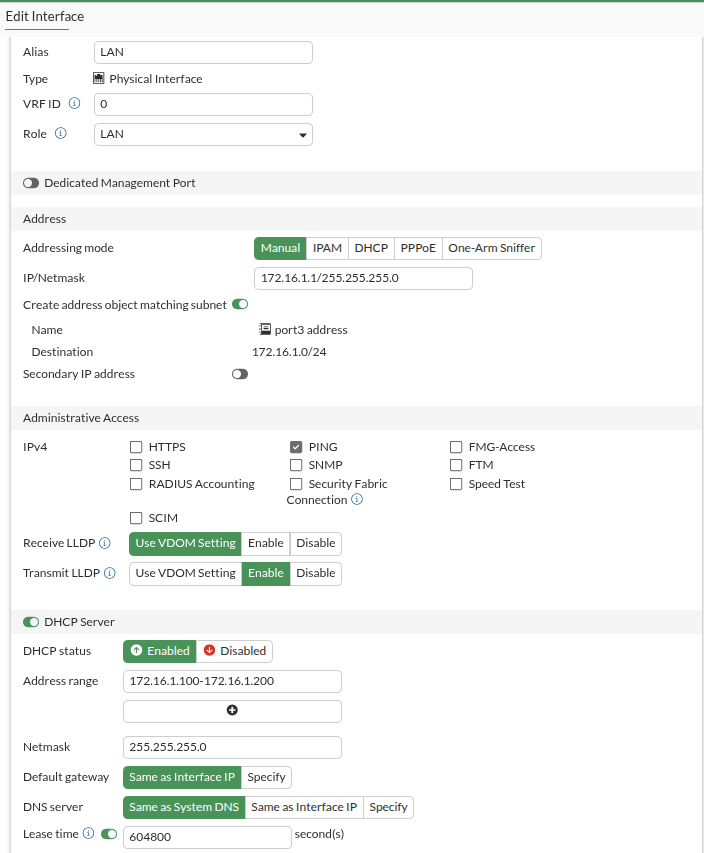

*État corrigé : le mode `Manual` est sélectionné, l'IP `172.16.1.1/24` est conservée, et le serveur DHCP est activé avec la plage `.100 - .200`.*

**Validation : le mode d'adressage affiché dans le GUI est maintenant cohérent avec la configuration statique de `port3`. ✅**

---

#### 9.6.4 Deuxième test DHCP — résultat correct

Après correction, un renouvellement du bail DHCP a été effectué côté client :

```bash
sudo ifdown eth0 && sudo ifup eth0
```

Résultat :

```text
udhcpc: started, v1.36.1
udhcpc: broadcasting discover
udhcpc: broadcasting select for 172.16.1.100, server 172.16.1.1
udhcpc: lease of 172.16.1.100 obtained from 172.16.1.1, lease time 604800
```

Vérification de l'adresse IP obtenue :

```bash
ip addr show eth0
```

Résultat :

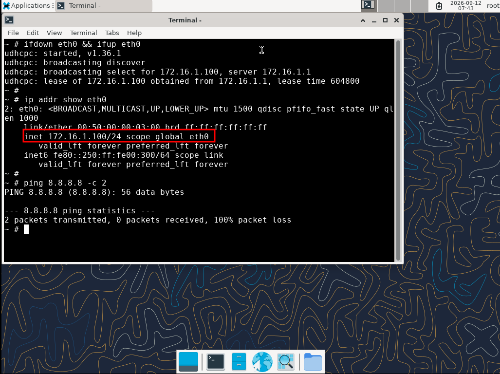

*Le client PC1 a obtenu automatiquement l'adresse `172.16.1.100/24` via le serveur DHCP du FortiGate. L'adresse est bien dans la plage DHCP `172.16.1.100 - 172.16.1.200`.*

Extrait :

```text
2: eth0: <BROADCAST,MULTICAST,UP,LOWER_UP> mtu 1500 qdisc pfifo_fast state UP
    link/ether 00:50:00:00:03:00 brd ff:ff:ff:ff:ff:ff
    inet 172.16.1.100/24 scope global eth0
    valid_lft forever preferred_lft forever
```

**Validation : le client a obtenu `172.16.1.100/24` via DHCP, dans la plage prévue. ✅**

---

Test de connectivité vers la passerelle :

```bash
ping -c 2 172.16.1.1
```

Résultat :

```text
PING 172.16.1.1 (172.16.1.1): 56 data bytes
64 bytes from 172.16.1.1: icmp_seq=0 ttl=255 time=7.496 ms
64 bytes from 172.16.1.1: icmp_seq=1 ttl=255 time=2.334 ms

--- 172.16.1.1 ping statistics ---
2 packets transmitted, 2 packets received, 0% packet loss
```

**Validation : le client atteint la passerelle LAN (FortiGate). ✅**

---

Test d'accès Internet (avant NAT) :

```bash
ping -c 2 8.8.8.8
```

Résultat :

```text
PING 8.8.8.8 (8.8.8.8): 56 data bytes

--- 8.8.8.8 ping statistics ---
2 packets transmitted, 0 packets received, 100% packet loss
```

Et test DNS :

```bash
ping -c 2 google.com
```

Résultat :

```text
ping: bad address 'google.com'
```

**Interprétation** : le client ne peut **pas encore** atteindre Internet car :

1. Le **NAT** n'est pas configuré sur le FortiGate.
2. Le **DNS** n'est pas résolu (nécessite une configuration DNS côté client ou DHCP).

Ces deux points seront traités dans les sections suivantes.

> ⚠️ **État actuel** : la chaîne LAN → WAN fonctionne au niveau routage (le client atteint la passerelle), mais le **NAT** est nécessaire pour que les clients LAN puissent sortir vers Internet.

---

#### 9.6.5 Bilan du diagnostic DHCP

| Étape | Mode GUI | Adresse obtenue | Statut |
|---|---|---|---|
| **1er test** | `IPAM` (incohérent) | `172.16.1.10` (hors plage) | ❌ |
| **Correction** | `Manual` (cohérent) | — | ✅ |
| **2e test** | `Manual` | `172.16.1.100` (dans la plage) | ✅ |

Cette étape confirme que :

- Le **serveur DHCP du FortiGate** distribue correctement les adresses.
- L'**incohérence GUI/CLI** sur le mode d'adressage (`IPAM` vs `Manual`) peut fausser la distribution des adresses.
- Il est **indispensable** de vérifier la cohérence entre les deux interfaces après une configuration.

---

## 10. Configuration du NAT

Maintenant que les interfaces et le routage sont en place, il reste à configurer le **NAT** (Network Address Translation) pour permettre aux clients du LAN de sortir vers Internet.

### 10.1 Création de la policy NAT

Une policy firewall autorisant le trafic **LAN → WAN** avec NAT a été créée.

```bash
config firewall policy
    edit 1
        set name "LAN-to-WAN"
        set srcintf "port3"
        set dstintf "port1" "port2"
        set action accept
        set srcaddr "all"
        set dstaddr "all"
        set schedule "always"
        set service "ALL"
        set nat enable
    next
end
```

**Rôle des commandes :**
- `edit 1` : crée la policy numéro 1.
- `set name "LAN-to-WAN"` : nomme la policy.
- `set srcintf "port3"` : source = LAN.
- `set dstintf "port1" "port2"` : destinations = les deux WAN (permet le failover).
- `set action accept` : autorise le trafic.
- `set srcaddr "all"` / `set dstaddr "all"` : toutes les adresses.
- `set schedule "always"` : policy active en permanence.
- `set service "ALL"` : tous les services.
- `set nat enable` : **active le NAT sortant**.

### 10.2 Vérification de la policy

```bash
show firewall policy
```

Résultat :

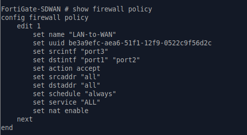

*Policy `LAN-to-WAN` : source `port3`, destination `port1` + `port2`, NAT activé.*

**Validation : policy NAT `LAN-to-WAN` configurée avec succès. ✅**

---

### 10.3 Test d'accès Internet depuis le LAN

Depuis le client PC1 (`172.16.1.100`), test d'accès Internet :

```bash
ping -c 3 8.8.8.8
```

Résultat :

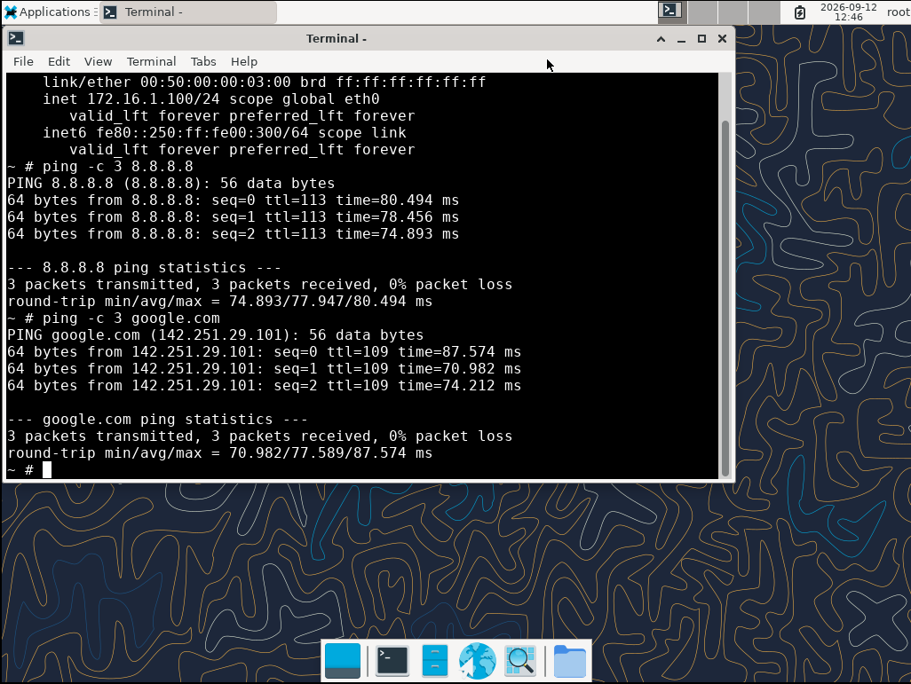

*Test d'accès Internet depuis PC1 : ping vers 8.8.8.8 réussi (0% perte), ping vers google.com réussi avec résolution DNS.*

**Validation : accès Internet fonctionnel depuis le LAN. ✅**

---

### 10.4 Test de résolution DNS

Test de résolution DNS depuis PC1 :

```bash
ping -c 3 google.com
```

Résultat :

```text
PING google.com (142.251.29.101): 56 data bytes
64 bytes from 142.251.29.101: icmp_seq=0 ttl=109 time=87.574 ms
64 bytes from 142.251.29.101: icmp_seq=1 ttl=109 time=70.982 ms
64 bytes from 142.251.29.101: icmp_seq=2 ttl=109 time=74.212 ms

--- google.com ping statistics ---
3 packets transmitted, 3 packets received, 0% packet loss
round-trip min/avg/max = 70.982/77.589/87.574 ms
```

**Interprétation** :
- `google.com` a été résolu en `142.251.29.101` → la **résolution DNS fonctionne**.
- Le ping a réussi → l'**accès Internet fonctionne**.

**Validation : résolution DNS et accès Internet fonctionnels depuis le LAN. ✅**

> **Note** : les clients du LAN reçoivent les serveurs DNS du FortiGate via DHCP (`dns-service default`). Le FortiGate utilise ses propres DNS système pour répondre aux clients.

---

### 10.5 État du lab après configuration du NAT

```text
FortiGate-SDWAN
├── Hostname FortiGate-SDWAN       ✅
├── Licence Valid                  ✅
├── port1 → WAN ISP1               ✅ (192.168.120.10/24)
├── port2 → WAN ISP2               ✅ (192.168.121.10/24)
├── port3 → LAN                    ✅ (172.16.1.1/24)
├── DHCP port3                     ✅ (172.16.1.100 - 172.16.1.200)
├── Route par défaut ISP1          ✅
├── Route par défaut ISP2          ✅
├── Failover automatique           ✅
├── Policy NAT LAN → WAN           ✅
├── Accès Internet depuis LAN      ✅
├── Résolution DNS depuis LAN      ✅
└── SD-WAN                          ⏳ (à configurer)
```

---

## 11. Configuration du SD-WAN

Le SD-WAN (Software-Defined Wide Area Network) permet de gérer intelligemment plusieurs liens WAN en fonction de règles et de la qualité mesurée des liens.

### 11.1 Vérification de l'état initial du SD-WAN

Avant toute modification, la configuration SD-WAN existante a été vérifiée.

```bash
show system sdwan
```

Résultat (extrait) :

```text
config system sdwan
    config zone
        edit "virtual-wan-link"
        next
    end
    config health-check
        edit "Default_DNS"
            set system-dns enable
            set interval 1000
            set probe-timeout 1000
            set recoverytime 10
            config sla
                edit 1
                    set latency-threshold 250
                    set jitter-threshold 50
                    set packetloss-threshold 5
                next
            end
        next
        ...
    end
end
```

**Interprétation** :

- La zone SD-WAN **`virtual-wan-link`** existe déjà par défaut.
- **5 health-checks** sont pré-configurés par FortiOS :
  - `Default_DNS`
  - `Default_Office_365`
  - `Default_Gmail`
  - `Default_Google Search`
  - `Default_FortiGuard`
- **Aucun membre** n'est encore configuré dans le SD-WAN.

> ⚠️ **Point important** : les health-checks par défaut existent, mais ils ne sont **pas utilisés** tant que le SD-WAN n'est pas activé et que des membres ne sont pas ajoutés.

---

### 11.2 Activation du SD-WAN

Le SD-WAN a d'abord été activé avec :

```bash
config system sdwan
    set status enable
end
```

Le FortiGate a affiché un avertissement :

```text
Warning: please configure at least one member.
```

Cet avertissement est **normal** : le SD-WAN est activé mais ne contient encore aucun membre.

Vérification :

```bash
show system sdwan | grep status
```

Résultat :

```text
set status enable
```

**Validation : le SD-WAN est maintenant activé. ✅**

> ⚠️ **Séquence obligatoire** : sur FortiOS 7.6.2, le SD-WAN doit être **activé** (`set status enable`) **avant** de pouvoir ajouter des membres.

---

### 11.3 Tentative d'ajout de port1 comme membre (échec CLI + GUI)

Une première tentative d'ajout de `port1` comme membre SD-WAN a été effectuée en CLI :

```bash
config system sdwan
    config members
        edit 1
            set interface "port1"
            set zone "virtual-wan-link"
        next
    end
end
```

La commande `set interface "port1"` retourne :

```text
entry not found in datasource
value parse error before 'port1'
Command fail. Return code -3
```

Une vérification complémentaire a ensuite été effectuée via l'interface graphique : **SD-WAN → SD-WAN Zones → + Create new → SD-WAN Member**.

Le formulaire `Edit SD-WAN Member` affiche la liste des interfaces disponibles dans le champ **Interface** :

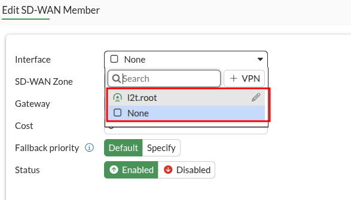

*Le formulaire `Edit SD-WAN Member` ne propose que l'interface `l2t.root` (et `None`). Les interfaces `port1` et `port2` ne sont pas disponibles pour la création manuelle d'un membre SD-WAN.*

**Constat** : l'erreur est reproduite à l'identique en **CLI** et en **GUI**.

---

#### 11.3.1 Cause identifiée

La cause de ce blocage a été **confirmée** par la suite via le wizard `Integrate Interface` (section 11.4). L'interface `port1` est **référencée dans deux configurations actives** :

| Configuration | Détail |
|---|---|
| **Policy NAT `LAN-to-WAN`** (`firewall policy` edit 1) | `set dstintf "port1" "port2"` |
| **Route statique par défaut** (`router static` edit 1) | `set device port1` |

Tant que ces références existent, FortiOS **refuse** d'ajouter `port1` comme membre SD-WAN via la commande `set interface`.

**Ce comportement est cohérent** : FortiOS ne veut pas casser une configuration active en déplaçant une interface. Il faut d'abord **migrer** les références vers la zone SD-WAN, ou **modifier** ces configurations pour qu'elles pointent vers `virtual-wan-link`.

> **Solution officielle Fortinet** : utiliser la fonction **`Integrate Interface`** dans le GUI, qui migre automatiquement les références. Cette procédure est documentée en section **11.4**.

---

### 11.4 Migration de port1 vers SD-WAN (via GUI)

La commande CLI directe n'étant pas possible (erreur `entry not found in datasource`), la migration a été effectuée via l'**interface graphique FortiGate**, qui gère automatiquement la migration des références existantes.

#### 11.4.1 Accès à la fonction `Integrate Interface`

Dans **Network → Interfaces**, un **clic droit** sur `port1` (ou le menu **More**) permet d'accéder à la fonction **`Integrate Interface`**.

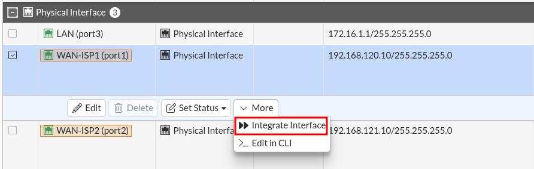

*Menu contextuel de l'interface `port1` : les options disponibles sont `Integrate Interface` et `Edit in CLI`. C'est `Integrate Interface` qui permet de migrer l'interface vers SD-WAN.*

> ⚠️ **Découverte** : la fonction `Integrate Interface` est la **solution officielle Fortinet** pour migrer une interface **déjà référencée** vers une zone SD-WAN. Elle met automatiquement à jour les configurations existantes.

---

#### 11.4.2 Étape 1/4 — Choix du mode de migration

Le wizard **Move port1 into an interface** propose 3 options :

| Option | Description |
|---|---|
| `Migrate to Interface` | Migration vers une interface (agrégat, redondance) |
| `Migrate to Zone` | Migration vers une zone standard |
| **`Migrate to SD-WAN`** | Migration vers une zone SD-WAN existante |

L'option **`Migrate to SD-WAN`** a été sélectionnée.

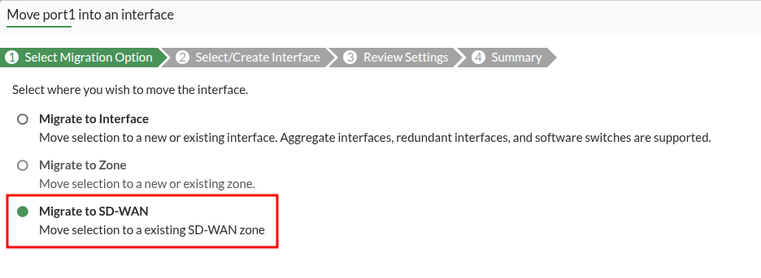

*Étape 1 du wizard : sélection de `Migrate to SD-WAN`.*

---

#### 11.4.3 Étape 2/4 — Choix de la zone SD-WAN

L'étape suivante demande de choisir la **zone SD-WAN cible**.

Une seule zone est disponible : **`virtual-wan-link`** (zone par défaut).

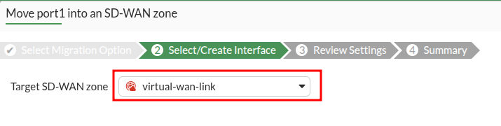

*Étape 2 du wizard : sélection de la zone `virtual-wan-link`.*

---

#### 11.4.4 Étape 3/4 — Review Settings

Le wizard affiche **toutes les références à `port1`** qui seront automatiquement migrées :

| Name | Object Type | Action |
|---|---|---|
| **`LAN-to-WAN (1)`** | Firewall Policy | **Replace Instance** |
| **`1`** | Static Route | **Replace Instance** |

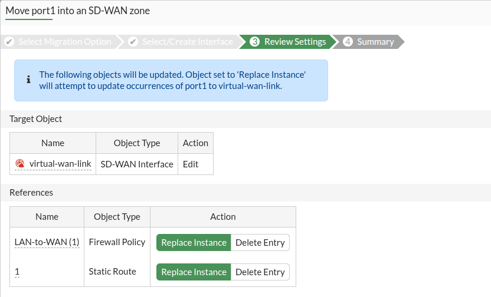

*Étape 3 du wizard : les deux configurations qui référencent `port1` sont détectées. L'action `Replace Instance` remplacera `port1` par `virtual-wan-link` dans ces objets.*

**Interprétation** : les deux configurations qui référencent `port1` sont :

- La **policy NAT** `LAN-to-WAN`
- La **route statique** par défaut (`edit 1`)

FortiOS va automatiquement remplacer `port1` par `virtual-wan-link` dans ces deux objets.

---

#### 11.4.5 Confirmation

Une boîte de dialogue de confirmation demande de valider les changements.

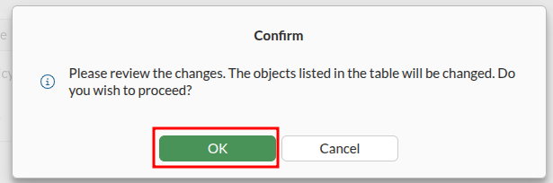

*Confirmation : « Please review the changes. The objects listed in the table will be changed. Do you wish to proceed? »*

---

#### 11.4.6 Étape 4/4 — Summary

Après validation, le wizard affiche le **récapitulatif des migrations** :

| Name | Object Type | Status |
|---|---|---|
| `virtual-wan-link` | SD-WAN Interface | ✅ **Updated entry** |
| `LAN-to-WAN (1)` | Firewall Policy | ✅ **Updated entry** |
| `1` | Static Route | ℹ️ **No changes** |

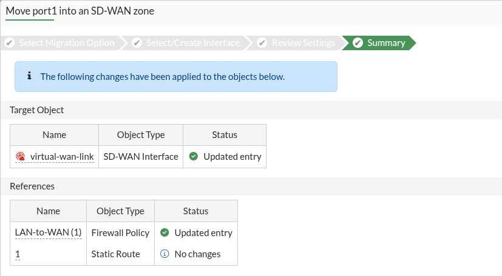

*Étape 4 du wizard : récapitulatif après migration. La zone `virtual-wan-link` et la policy `LAN-to-WAN` ont été mises à jour. La route statique n'a pas eu besoin d'être modifiée (probablement déjà migrée automatiquement ou non concernée).*

**Validation : `port1` est maintenant membre de la zone SD-WAN `virtual-wan-link`. ✅**

> **Note** : la policy `LAN-to-WAN` référence désormais `virtual-wan-link` au lieu de `port1`. La route statique a été automatiquement conservée (le FortiOS a déterminé qu'aucun changement n'était nécessaire).

---
#### 11.4.7 Validation finale — Ajout de port1 comme membre

Après la migration GUI, l'ajout de `port1` comme membre SD-WAN a été effectué en CLI **sans erreur** :

```bash
config system sdwan
    config members
        edit 1
            set interface "port1"
            set zone "virtual-wan-link"
        next
    end
end
```
Aucune erreur n'a été retournée.

Vérification :

```bash
show system sdwan
```

Résultat (extrait) :

```text
config system sdwan
    set status enable
    config zone
        edit "virtual-wan-link"
        next
    end
    config members
        edit 1
            set interface "port1"
        next
    end
    config health-check
        ...
    end
end
```
**Validation : `port1` est bien membre de la zone SD-WAN `virtual-wan-link`. ✅**

> **Observation** : la ligne `set zone "virtual-wan-link"` n'apparaît pas dans le membre `edit 1`. C'est **normal** : `virtual-wan-link` étant la zone par défaut, le FortiGate ne l'affiche pas explicitement. Le membre est bien implicitement rattaché à cette zone.

> **Interprétation globale** : la migration GUI via `Integrate Interface` a **libéré `port1` de ses références** (route + policy NAT), ce qui a permis son ajout en CLI **sans erreur**. C'est la **démonstration** que le blocage venait bien des références existantes.

---

#### 11.4.8 Bilan de la migration de port1

| Étape | Méthode | Résultat |
|---|---|---|
| 1. Tentative directe CLI | `set interface "port1"` | ❌ `entry not found in datasource` |
| 2. Tentative directe GUI | `+ Create new → SD-WAN Member` | ❌ `port1` absent de la liste |
| 3. Migration via GUI | `Integrate Interface` | ✅ Migration réussie |
| 4. Ajout final CLI | `set interface "port1"` | ✅ **Accepté** |

**Conclusion** : `port1` est maintenant membre de la zone SD-WAN `virtual-wan-link`, et ses références (route + policy NAT) ont été automatiquement migrées vers la zone.

---

### 11.5 Migration de port2 vers SD-WAN (via GUI)

Comme pour `port1`, l'ajout direct de `port2` en CLI aurait échoué (références bloquantes). La migration a donc été effectuée **via l'interface graphique**, avec la même procédure `Integrate Interface`.

La procédure est identique à celle de `port1` (section 11.4) :

1. **Network → Interfaces**
2. Clic droit sur `port2` → **Integrate Interface**
3. Étape 1 : **Migrate to SD-WAN**
4. Étape 2 : **`virtual-wan-link`**
5. Étape 3 : Vérification des migrations proposées puis Apply
6. Confirmation → **OK**
7. Étape 4 : Summary

#### 11.5.1 Étape 4/4 — Summary

Après validation, le wizard affiche le récapitulatif des migrations :

| Name | Object Type | Status |
|---|---|---|
| `virtual-wan-link` | SD-WAN Interface | ✅ **Updated entry** |
| `LAN-to-WAN (1)` | Firewall Policy | ✅ **Updated entry** |
| `2` | Static Route | ℹ️ **No changes** |

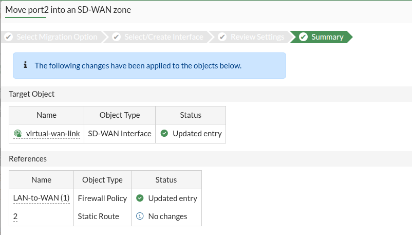

*Étape 4 du wizard pour `port2` : la zone `virtual-wan-link` et la policy `LAN-to-WAN` ont été mises à jour. La route statique n'a pas eu besoin d'être modifiée (elle avait déjà été migrée lors de la migration de `port1`).*

**Interprétation** :

- La zone `virtual-wan-link` a été **mise à jour** pour inclure `port2`.
- La policy `LAN-to-WAN` a été **mise à jour** pour retirer la référence à `port2` (remplacée par `virtual-wan-link`).
- La route statique `2` n'a **pas eu besoin** d'être modifiée — elle avait déjà été migrée lors de `port1` (les deux routes par défaut pointaient vers la même zone SD-WAN).

**Validation : la migration de `port2` vers la zone SD-WAN est terminée. ✅**

---

#### 11.5.2 Validation finale — Ajout de port2 comme membre

Après la migration GUI, l'ajout de `port2` comme membre SD-WAN a été effectué en CLI **sans erreur** :

```bash
config system sdwan
    config members
        edit 2
            set interface "port2"
            set zone "virtual-wan-link"
        next
    end
end
```

Vérification :

```bash
show system sdwan
```

Résultat (extrait) :

```text
config system sdwan
    set status enable
    config zone
        edit "virtual-wan-link"
        next
    end
    config members
        edit 1
            set interface "port1"
        next
        edit 2
            set interface "port2"
        next
    end
    config health-check
        edit "Default_DNS"
            ...
        next
        edit "Default_Office_365"
            ...
        next
        edit "Default_Gmail"
            ...
        next
        edit "Default_Google Search"
            ...
        next
        edit "Default_FortiGuard"
            ...
        next
    end
end
```

Vérification visuelle dans le GUI (**Network → SD-WAN → SD-WAN Zones**) :

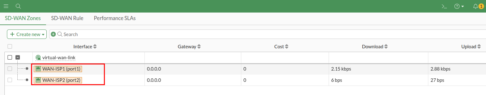

*La zone SD-WAN `virtual-wan-link` contient bien les deux membres `WAN-ISP1 (port1)` et `WAN-ISP2 (port2)`, avec la route par défaut `0.0.0.0/0`.*

**Validation : les deux interfaces WAN sont membres de la zone SD-WAN `virtual-wan-link`. ✅**
---

#### 11.5.3 Bilan de la migration de port2

| Étape | Méthode | Résultat |
|---|---|---|
| 1. Migration via GUI | `Integrate Interface` sur `port2` | ✅ Migration réussie |
| 2. Ajout final CLI | `set interface "port2"` | ✅ **Accepté** |

**Conclusion** : `port2` est maintenant membre de la zone SD-WAN `virtual-wan-link`, comme `port1`. La policy NAT a été automatiquement mise à jour pour référencer la zone au lieu de l'interface physique.

---


### 11.6 Configuration des gateways des membres SD-WAN

Après l'ajout de `port1` et `port2` comme membres SD-WAN, une vérification a montré qu'**aucun gateway n'était défini** sur les membres.

---

#### 11.6.1 Vérification initiale des routes statiques

Vérification des routes statiques :

```bash
show router static
```

Résultat :

```text
config router static
    edit 1
        set gateway 192.168.120.1
        set device "port1"
    next
    edit 2
        set gateway 192.168.121.1
        set device "port2"
    next
end
```

**Observation** : les routes statiques référencent encore les **interfaces physiques** (`port1`, `port2`) et non la zone SD-WAN.

---

#### 11.6.2 Vérification initiale des membres SD-WAN

Vérification des membres SD-WAN :

```bash
config system sdwan
    config members
        edit 1
            show
        next
        edit 2
            show
        next
    end
end
```

Résultat pour le membre 1 :

```text
config members
    edit 1
        set interface "port1"
    next
end
```

Résultat pour le membre 2 :

```text
config members
    edit 2
        set interface "port2"
    next
end
```

**Observation** : les deux membres (`port1` et `port2`) n'ont **aucun gateway défini**.

---

#### 11.6.3 Configuration des gateways

Les gateways des deux membres SD-WAN ont été définies en CLI :

```bash
config system sdwan
    config members
        edit 1
            set gateway 192.168.120.1
        next
        edit 2
            set gateway 192.168.121.1
        next
    end
end
```

**Rôle des commandes :**
- `edit 1` : membre 1 (`port1` — WAN ISP1).
- `set gateway 192.168.120.1` : passerelle ISP1.
- `edit 2` : membre 2 (`port2` — WAN ISP2).
- `set gateway 192.168.121.1` : passerelle ISP2.

---

#### 11.6.4 Vérification finale

```bash
show system sdwan
```

Résultat :

```text
config system sdwan
    set status enable
    config zone
        edit "virtual-wan-link"
        next
    end
    config members
        edit 1
            set interface "port1"
            set gateway 192.168.120.1
        next
        edit 2
            set interface "port2"
            set gateway 192.168.121.1
        next
    end
    ...
```

**Validation : les deux membres SD-WAN ont maintenant leur gateway défini. ✅**

| Membre | Interface | Gateway |
|---|---|---|
| 1 | `port1` | `192.168.120.1` |
| 2 | `port2` | `192.168.121.1` |

---

#### 11.6.5 État du SD-WAN après cette étape

```text
SD-WAN
├── Status                           ✅ Activé
├── Zone "virtual-wan-link"          ✅ Existe
├── Membre 1 (port1)                 ✅ Gateway 192.168.120.1
├── Membre 2 (port2)                 ✅ Gateway 192.168.121.1
├── Health-checks par défaut         ✅ Configurés (5)
├── Règles SD-WAN                    ⏳ À créer
└── Routes statiques                 ⚠️ Référencent port1/port2 (à revoir)
```

### 11.7 Migration des routes vers SD-WAN

Une fois les membres SD-WAN configurés avec leurs gateways (section 11.6), il reste à faire pointer la **route par défaut** vers la zone SD-WAN au lieu des interfaces physiques.

---

#### 11.7.1 Tentative de modification de la route 1 (échec)

La première tentative a consisté à modifier uniquement la **route 1** pour la faire pointer vers la zone SD-WAN :

```bash
config router static
    edit 1
        set sdwan-zone "virtual-wan-link"
    next
end
```

Résultat :

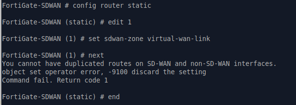

*La commande échoue avec l'erreur `You cannot have duplicated routes on SD-WAN and non-SD-WAN interfaces` (code -9100).*

Erreur complète :

```text
You cannot have duplicated routes on SD-WAN and non-SD-WAN interfaces.
object set operator error, -9100 discard the setting
Command fail. Return code 1
```

**Cause** : le FortiGate refuse de mélanger des routes par défaut SD-WAN et non-SD-WAN. La route 1 était en SD-WAN, mais la route 2 utilisait encore l'interface physique `port2`.

> ⚠️ **Point important** : FortiOS exige que **toutes les routes par défaut** soient du même type (soit toutes SD-WAN, soit toutes non-SD-WAN). Un mélange n'est pas autorisé.

---

#### 11.7.2 Décision — suppression des routes existantes

Pour résoudre le conflit, les deux routes statiques existantes ont été **supprimées** :

```bash
config router static
    delete 1
    delete 2
end
```

Vérification :

```bash
show router static
```

Résultat :

```text
config router static
end
```

**Validation : les deux routes statiques ont été supprimées. ✅**

---

#### 11.7.3 Création d'une route SD-WAN unique

Une **nouvelle route unique** pointant vers la zone SD-WAN a été créée :

```bash
config router static
    edit 1
        set sdwan-zone "virtual-wan-link"
    next
end
```

Résultat :

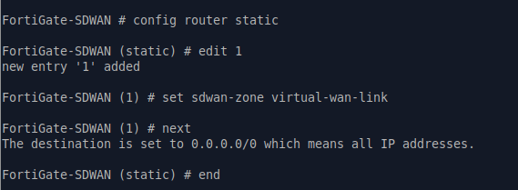

*La route SD-WAN est créée avec succès. Le FortiGate confirme que la destination `0.0.0.0/0` signifie « toutes les adresses IP ».*

Message affiché :

```text
The destination is set to 0.0.0.0/0 which means all IP addresses.
```

Vérification :

```bash
show router static
```

Résultat :

```text
config router static
    edit 1
        set distance 1
        set sdwan-zone "virtual-wan-link"
    next
end
```

**Observation** : le FortiGate a automatiquement ajouté `set distance 1` (distance administrative SD-WAN par défaut).

**Validation : route SD-WAN unique créée. ✅**

---

#### 11.7.4 Vérification de la table de routage

```bash
get router info routing-table all
```

Résultat :

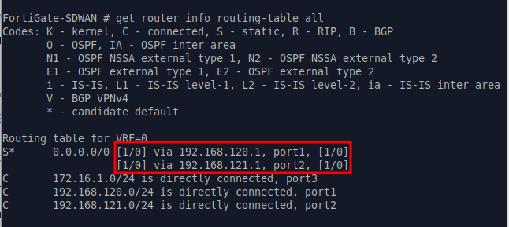

*La table de routage montre la route par défaut `S* 0.0.0.0/0` avec la distance `[1/0]` (distance SD-WAN), utilisant les deux membres `port1` (192.168.120.1) et `port2` (192.168.121.1).*

Extrait :

```text
Routing table for VRF=0
S*      0.0.0.0/0 [1/0] via 192.168.120.1, port1, [1/0]
                  [1/0] via 192.168.121.1, port2, [1/0]
C       172.16.1.0/24 is directly connected, port3
C       192.168.120.0/24 is directly connected, port1
C       192.168.121.0/24 is directly connected, port2
```

**Analyse** :

| Élément | Valeur |
|---|---|
| Route par défaut | `S* 0.0.0.0/0` |
| Distance | `[1/0]` (distance SD-WAN) |
| Membres utilisés | `port1` (192.168.120.1) et `port2` (192.168.121.1) |
| Réseaux connectés | Inchangés |

> **Note** : la table de routage affiche `port1` et `port2` (interfaces physiques), mais ces interfaces sont membres de la zone SD-WAN `virtual-wan-link`. La route utilise donc bien le SD-WAN pour router le trafic.
>
> La distance administrative est passée de `10` (routes statiques classiques) à `1` (distance SD-WAN par défaut).

**Validation : la route par défaut passe par le SD-WAN. ✅**

---

#### 11.7.5 Test d'accès Internet depuis le FortiGate

Depuis le FortiGate :

```bash
execute ping 8.8.8.8
```

Résultat :

```text
PING 8.8.8.8 (8.8.8.8): 56 data bytes
64 bytes from 8.8.8.8: icmp_seq=0 ttl=114 time=77.2 ms
64 bytes from 8.8.8.8: icmp_seq=1 ttl=114 time=71.5 ms
64 bytes from 8.8.8.8: icmp_seq=2 ttl=114 time=73.9 ms
64 bytes from 8.8.8.8: icmp_seq=3 ttl=114 time=71.6 ms
64 bytes from 8.8.8.8: icmp_seq=4 ttl=114 time=88.9 ms

--- 8.8.8.8 ping statistics ---
5 packets transmitted, 5 packets received, 0% packet loss
round-trip min/avg/max = 71.5/76.6/88.9 ms
```

**Validation : accès Internet fonctionnel via le SD-WAN depuis le FortiGate. ✅**

---

#### 11.7.6 État du SD-WAN après migration des routes

```text
SD-WAN
├── Status                           ✅ Activé
├── Zone "virtual-wan-link"          ✅ Existe
├── Membre 1 (port1)                 ✅ Gateway 192.168.120.1
├── Membre 2 (port2)                 ✅ Gateway 192.168.121.1
├── Health-checks par défaut         ✅ Configurés (5)
├── Route par défaut SD-WAN          ✅ Créée
├── Table de routage                 ✅ Correcte
├── Test Internet depuis FortiGate   ✅
└── Test Internet depuis PC1         ⏳ À faire
```

**Ce qui reste à faire :**

1. **Tester** l'accès Internet depuis le LAN (PC1).
2. **Créer** des règles SD-WAN pour la sélection de chemin.
3. **Configurer** les Performance SLA.
4. **Tester** le load balancing et le failover SD-WAN.

---

### 11.8 Test d'accès Internet depuis PC1 (client LAN)

Maintenant que la route par défaut passe par la zone SD-WAN, il faut vérifier que les clients du LAN peuvent toujours accéder à Internet.

#### 11.8.1 Vérification de l'adresse IP de PC1

```bash
ip addr show eth0
```

Résultat :

```text
2: eth0: <BROADCAST,MULTICAST,UP,LOWER_UP> mtu 1500 qdisc pfifo_fast state UP
    link/ether 00:50:00:00:03:00 brd ff:ff:ff:ff:ff:ff
    inet 172.16.1.100/24 scope global eth0
    valid_lft forever preferred_lft forever
```

**Validation** : PC1 dispose bien de l'adresse `172.16.1.100/24` obtenue par DHCP. ✅

---

#### 11.8.2 Test d'accès Internet avec résolution DNS

Depuis PC1 :

```bash
ping -c 3 google.com
```

Résultat :

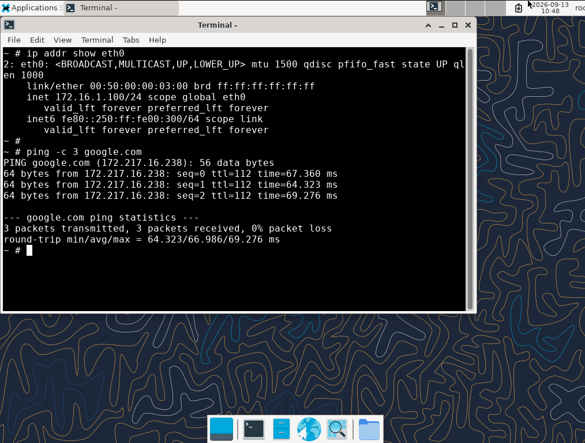

> **Figure — Validation de l'accès Internet depuis PC1 après intégration des liens WAN dans le SD-WAN.**

Extrait :

```text
PING google.com (172.217.16.238): 56 data bytes
64 bytes from 172.217.16.238: icmp_seq=0 ttl=112 time=67.360 ms
64 bytes from 172.217.16.238: icmp_seq=1 ttl=112 time=64.323 ms
64 bytes from 172.217.16.238: icmp_seq=2 ttl=112 time=69.276 ms

--- google.com ping statistics ---
3 packets transmitted, 3 packets received, 0% packet loss
round-trip min/avg/max = 64.323/66.986/69.276 ms
```

**Interprétation** :

- `google.com` a été résolu en `172.217.16.238` → la **résolution DNS fonctionne**.
- 3 paquets sur 3 reçus → l'**accès Internet fonctionne** via le SD-WAN.

**Validation : accès Internet et résolution DNS fonctionnels depuis PC1 via le SD-WAN. ✅**
On a donc une validation **FortiGate + SD-WAN + LAN client + NAT + DNS + Internet**.

---

#### 11.8.3 Vérification de la policy LAN → SD-WAN

Après la migration de la route par défaut vers la zone SD-WAN, la policy
`LAN-to-WAN` a été vérifiée afin de confirmer que le trafic provenant du
LAN est bien dirigé vers la zone `virtual-wan-link`.

```bash
show firewall policy
````

Résultat :

```text
config firewall policy
    edit 1
        set name "LAN-to-WAN"
        set uuid f7d3227a-aebe-51f1-cd8f-12cc37dc7092
        set srcintf "port3"
        set dstintf "virtual-wan-link"
        set action accept
        set srcaddr "all"
        set dstaddr "all"
        set schedule "always"
        set service "ALL"
        set nat enable
    next
end
```

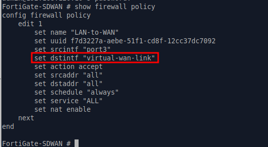

> **Figure — Vérification de la policy `LAN-to-WAN` utilisant la zone `virtual-wan-link`.**

**Validation :**

* `port3` → interface source du LAN ;
* `virtual-wan-link` → zone SD-WAN de destination ;
* `action accept` → trafic autorisé ;
* `schedule "always"` → policy active en permanence ;
* `service "ALL"` → tous les services autorisés ;
* `nat enable` → NAT activé pour la sortie Internet.

Cette vérification confirme que la policy utilise désormais la **zone SD-WAN**
et non directement `port1` ou `port2`.

**Validation : policy LAN → SD-WAN correctement configurée. ✅**

---

#### 11.8.4 État du SD-WAN après ce test

```text
SD-WAN
├── Status                           ✅ Activé
├── Zone "virtual-wan-link"          ✅ Existe
├── Membre 1 (port1)                 ✅ Gateway 192.168.120.1
├── Membre 2 (port2)                 ✅ Gateway 192.168.121.1
├── Health-checks par défaut         ✅ Configurés (5)
├── Route par défaut SD-WAN          ✅ Créée
├── Table de routage                 ✅ Correcte
├── Test Internet depuis FortiGate   ✅
└── Test Internet depuis PC1         ✅
```

**Ce qui reste à faire :**

1. **Créer** des règles SD-WAN pour la sélection de chemin.
2. **Configurer** les Performance SLA.
3. **Tester** le load balancing et le failover SD-WAN.


